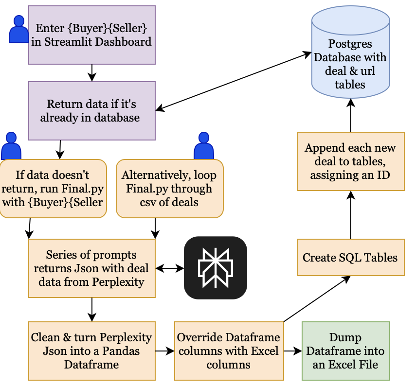
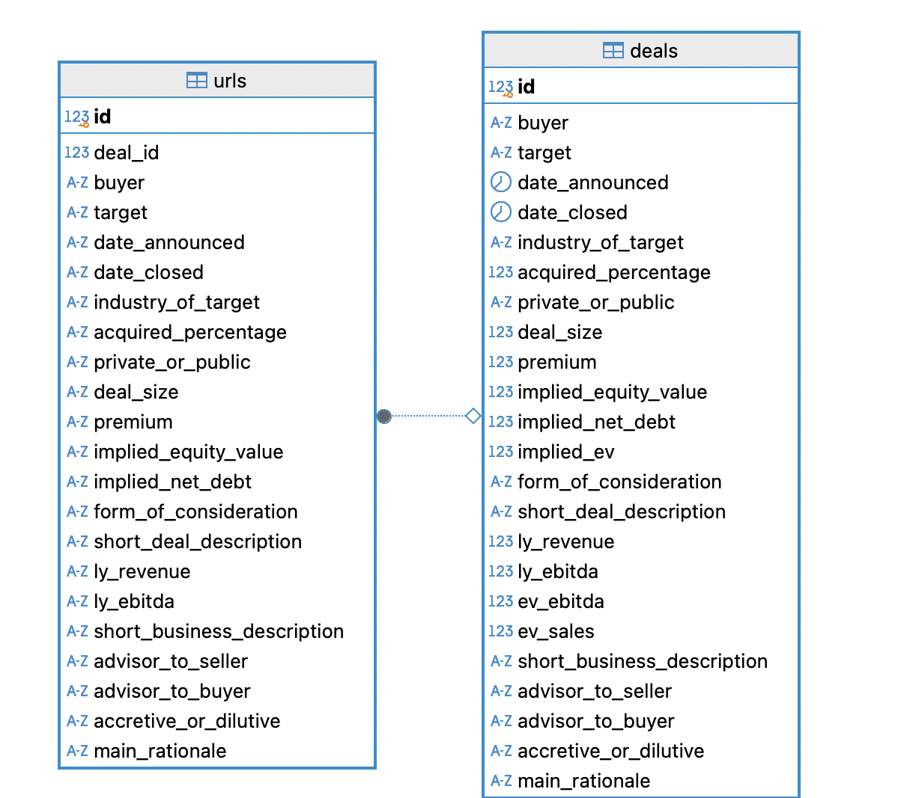

# Group Members
Matias Ibarburu

Vighnesh Avadhanam

Benjamin Hinrichs

Maksim Korenev

Chris Cain

# Goal of the Analysis
The goal of this project is to automate a mind-numbing and time intensive process for Investment Banking Analysts. For any Merger or Acquisition, there is an industry standard sheet that must be filled out with basic information to create a deal profile. The goal of this project was to use an LLM to fill out this sheet for any given transaction when the user entered the names of two companies who engaged in the deal.

In order to maximize the accessibility and manipulability of the data, we decided to append the data to a table within a SQL Postgres database on Google Cloud, as well as return an Excel file. Because this information is used to inform financial decisions, we prioritized accuracy and ease of access to citations by making links accessible in a connected table. 
# Methodology

## Overview

## Data Gathering
The original Investment Banking information sheet we wanted to recreate had these fields: 

We were faced with the fact that the information needed to fill out these fields would encompass many different types of data, and we would also have to carefully engineer prompts so that the AI returned something our functions could automatically parse. The information is all publicly available, but must be gathered from a combination of news sources and company reports. Because of this unique combination of data, we first chose to approach the problem using a ChatGPT API. ChatGPT responded remarkably well to our prompts when we input them in the web interface directly, however, when we tried to do those same prompts through the API the quality fell of dramatically. Additionally, ChatGPT has some difficulty returning valid links, which would have made our reference table difficult.

We did some research and switched over to a Perplexity API. Perplexity is specifically designed for research and has a much more rigorous system in place to pull valid sources. Perplexity did a much better job of pulling data accurately through the API. We realized that while Perplexity gathered text-based information very well, it had some difficulty producing certain numeric values. In particular, EV and Ebitda caused Perplexity to report arbitrary numbers or just repeat a different value it had already created. After we had scraped all the other columns through Perplexity, we created a function that generated the needed variables and added them to the Pandas dataframe. We manually calculated EV as Equity (capitalization of the target company) plus net debt and Ebitda as operating profit plus depreciation and amortization. Even though Perplexity couldn't reliably pull that data from the internet, we could generate it from other information that could be. 

While Perplexity could return most of the data effectively, we recognized that it would be nearly impossible to always get accurate data or even data at all for any specific value. The fact that Perplexity could become confused or even refuse to return a specific value meant that we had to allow some more room for human intervention, both for filling in missing values and verifying fishy values. As we narrowed down our prompts we began to trust Perplexity's data, and most of our problems came from Perplexity being hesitant to put down anything it wasn't exceedingly sure of. For filling in those fields that Perplexity didn't feel comfortable giving, we added a link table with the source for each variable. While the AI didn't always return a value, it consistently gave a relevant link, even for fields it couldnt fully fill out.  

## Structure
We created a Streamlit dashboard where the user entered the company names of the companies involved in the deal. If the deal had already been entered in the deal database, the information would be returned to the user directly in Streamlit. If the deal does not return, the user can either run Final.py and and enter company names directly (mode 1), or loop Final.py through a c with a large list of deals. The two company names are then pushed into Perplexity alongside a series of unique prompts from an Excel file. Along side the unique prompt for each variable, we listed the data type we wanted Perplexity to return the information as.

We found that Perplexity wouldn't get bogged down when we gave more specific information, but rather, that it was quite good at honing down its search. We struggled with a majority of null values early on, but through careful consideration and lengthening of the prompts we cut down on these. Perplexity returns a Json, which we then clean and turn into a Pandas dataframe. This dataframe has two tables with the same columns, one table with the data, and the other with the corresponding URL from which the data was derived. 

We create the additional columns through direct calculation in Python and add them to the dataframe. Even with some more refinement of the prompts, Perplexity was still unable to return several data fields, so we continued with our original plan of calculating them. After that step, we override the dataframe's row names with the row names from an Excel file, just as an extra quality check to make sure the data is compatible with the SQL database tables. We added this step so the tables always agreed with each other and even if a specific value wasn't able to be calculated we could still have all the information in one place. We add an id for each deal, then add it to the database. 

You might notice that the url and deal tables rows do not match. You would do well to remember that we calculated some of the data in Python, and thus, that data's source is the same as the data that was used to calculate it. The url table allows each piece of information to be verified, or for null values to be filled in, because Perplexity is better at giving links than data. 

As a complement to the database we produce an Excel file for each transaction, with a sheet for data along with a sheet for the associated sources. Any given deal that is entered into Final.py can accessed on streamlit, queried from the SQL database, or viewed as an Excel file.

# Findings
After running 100 companies through, the biggest areas of error became apparent.
I WILL MAKE A GRAPH OF THIS

# Limitations

## 100% Data Accuracy
While even a human filling out this sort of sheet would have errors, the fact that they can take responsibility for those errors means they avoid a judgment on their capability, and can chalk that error up to a momentary defect. While most variables that are returned, are returned accurately, if a decision is to be made, it is vital that every value is accurate. This creates a paradox which could hypothetically undo the time-saving effects of our project: every value might be wrong, and thus must be double checked by someone or something else. We are confident that this project provides a robust framework that can be built upon to ensure higher data accuracy, but the fact remains that we cannot ever be fully confident that any one output is correct.

## Obscure Deals
Smaller deals have less publicly available information, and Perplexity has a higher chance of not returning values for a given deal if it cannot cross reference a specific fact across several sources. Some smaller deals might only release their information to a website that has protection against AI crawlers. 

## Company Names
Because the user enters company names and Perplexity is able to handle a wide range of name variants, the company names in the database will be very unstandardized, which could cause some trouble in accessing them later. Particularly when users enter one deal at a time rather than loop through a csv of deals, there is no record of how specifically they chose to enter the name of each company, which could cause some consternation when attempted to access data at a later time. However, most banking applications for our project would have a banker pull deals from an assigned sheet, which could later be used to dig up any specific deal's data. 

# Extensions for Future Improvement

## Choice of LLM
Due to the fact that we are students and not Investment Bankers, we decided not to not do countless pro searches within Perplexity as we populated our database. We have found that using a more costly version of Perplexity is able to provide data with far fewer null values. We tried to get our prompts and system to work well without accessing Perplexity's full strength. If we were to do this in a professional setting, we would simply make the choice to do all of these same steps but with a better version of Perplexity, thus saving even more time. 

## Prompt Engineering
While we put some thought into our prompts, we recognize that someone with a deeper understanding of the innerworkings of a LLM could do a better job of writing prompts that would not be misinterpreted. We see 

## Verification
Our project's credibility would be greatly increased if we cross-referenced our data from Perplexity with data from Factset or some other reliable database. While some of the fields we gather could not be found within a database, it would be helpful to gather data from one of these reliable sources first then patch Perplexity data on top of that.

## Data Interaction Dashboard
While we are aiming to produce accurate data, the reality of mistakes and null values make a manual data interaction dashboard appealing. It could return the missing fields, and the human banker could fill them out. Bankers could also benefit from the ability to override and replace a field within the database if they found that a value was wrong. 

Requirements for reporting your analysis:

The goal of the analysis is must be clearly articulated
The report must include your methodology
The report must include a description of your project and its findings (or lack of findings)
Your findings (or non-findings) must be clearly documented
Your findings must be supported by your analysis
The limitations of the analysis must be clearly outlined
Extensions of your analysis or areas for more research must be included in your report
You should not include analysis, plots, discoveries, that aren’t directly related to your findings – you can put them as an appendix in another file if you like
Requirements for reporting about the data:

Source(s) of dataset(s) must be clearly documented
Data collection methods must be understood and clearly documented. You should read and summarize the documentation of the data, make sure that you understand and document all columns/features that are relevant to your analysis. You should understand and summarize what isn’t in the data too.
Limitations of the data must be clearly outlined
A discussion of extensions of data that would be required to improve the analysis should be included
