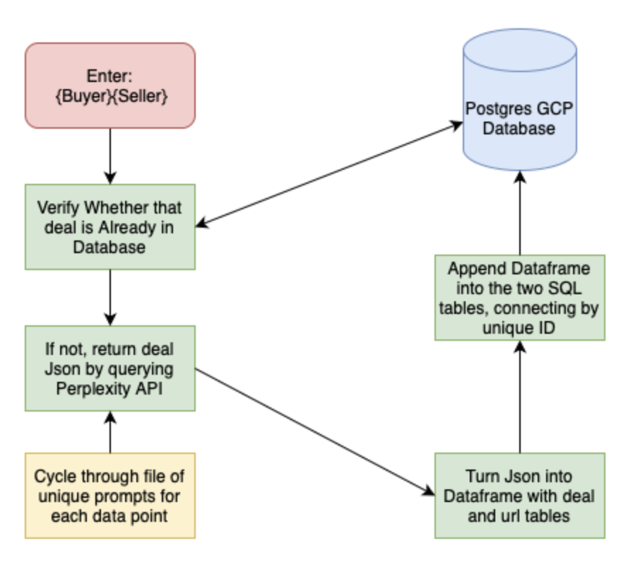

# Group Members
Matias Ibarburu
Vighnesh Avadhanam
Benjamin Hinrichs
Maksim Korenev
Chris Cain

# Goal of the Analysis
The goal of this project is to automate a mind-numbing and time intensive process for Investment Banking Analysts. For any Merger or Acquisition, there is an industry standard sheet that must be filled out with basic information to create a deal profile. The goal of this project was to use an LLM to fill out this sheet for any given transaction, and then append it to a SQL database.

In order to allow the accuracy of the information returned to be verified, we assigned an ID number to each deal and connected each deal to a corresponding table full of links for each individual data point. 
Because this information is used to inform financial decisions, we wanted to prioritize accuracy and ease of access to citations. 
# Methodology
include original sheet
The original Investment Banking information sheet we wanted to recreate. This sheet takes 20 to 30 minutes for any given deal to be described. It contains a combination of quantitative and qualitative information that can only be gathered from a wide variety of sources. The information is all publicly available, but must be gathered from a combination of news sources and company reports. 
Because of this unique combination of data, we first chose to approach the problem using a ChatGPT API. ChatGPT responded remarkably well to our prompts when we input them in the web interface directly, however, when we tried to do those same prompts through the API the quality fell of dramatically. Additionally, ChatGPT has some difficulty returning valid links, which would have made our reference table difficult.
We did some research and switched over to a Perplexity API. Perplexity is specifically designed for research and has a much more rigorous system in place to pull valid sources. 

additionally include list of prompts

Additionally include database picture

We initially attempted to use ChatGPT as our LLM. It worked very well when we fed it prompts through the web interface

Requirements for reporting your analysis:

The goal of the analysis is must be clearly articulated
The report must include your methodology
The report must include a description of your project and its findings (or lack of findings)
Your findings (or non-findings) must be clearly documented
Your findings must be supported by your analysis
The limitations of the analysis must be clearly outlined
Extensions of your analysis or areas for more research must be included in your report
You should not include analysis, plots, discoveries, that aren’t directly related to your findings – you can put them as an appendix in another file if you like
Requirements for reporting about the data:

Source(s) of dataset(s) must be clearly documented
Data collection methods must be understood and clearly documented. You should read and summarize the documentation of the data, make sure that you understand and document all columns/features that are relevant to your analysis. You should understand and summarize what isn’t in the data too.
Limitations of the data must be clearly outlined
A discussion of extensions of data that would be required to improve the analysis should be included
